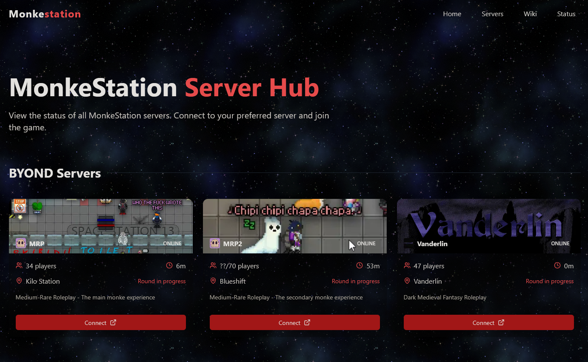

# Monkestation Game Hub



<hr>

This is the repo of our game hub hosted at https://play.monkestation.com

It makes use of a proprietary API called Plexora (Kind of hard to explain what it is but TL;DR server management service)

Mock API's will eventually be provided for those looking to help contribute to the design of the game hub.


# TODO

- [ ] Fix multple repeated API querys, likely through the use of caching server side. (Actually yes, should do that)
- [ ] Cleanup code that's obviously bad
- [ ] Github link to repo at the bottom and github link at the top for the org
- [ ] For image lookup I could technically just make a component that wraps an image and asyncronously determines the extension of a file for a key.

# Setting up

```
pnpm install
pnpm run dev
# or 
pnpm run build
pnpm run start
```
